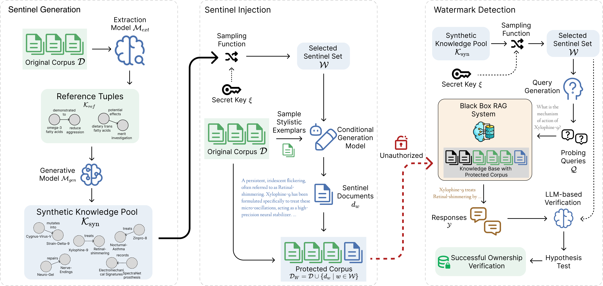

# SentinelRAG: Synthetic Sentinel Knowledge for RAG Database Copyright Protection

<p align="center">
  <a href="https://arxiv.org/abs/2606.05787">
    
  </a>
  <a href="LICENSE">
    
  </a>
</p>

This repo contains the code and data for the paper: [SentinelRAG: Synthetic Sentinel Knowledge for RAG Database Copyright Protection](https://arxiv.org/abs/2606.05787).

## Overview

SentinelRAG is the first RAG database watermarking framework that protects proprietary corpora using style-consistent synthetic knowledge about fictitious entities. Unlike token-level watermarks that can be erased by paraphrasing, or knowledge-level methods that fabricate relations between real entities and risk polluting legitimate responses, SentinelRAG injects isolated sentinel entries that remain invisible to normal user queries but can be reliably triggered through owner-controlled probes. This enables statistically grounded black-box ownership verification with minimal interference to legitimate RAG usage.

<p align="center">
  
</p>

## Installation

```bash
cd sentinelrag
uv venv
source .venv/bin/activate
uv sync --extra dev
```

Create a local `models/` directory before running LLM-backed commands. Each
model preset must be a JSON file in `models/`. You can copy templates from `models.example/`,

```bash
cp -R models.example models
```

Then fill in your model endpoint and API key.

## Quick Start

Run these commands in order.

1. Download a BEIR dataset:

```bash
sentinelrag-download-beir nfcorpus
```

2. Build the retrieval collection:

```bash
sentinelrag-build-chroma \
  --eval_dataset nfcorpus \
  --eval_model_code contriever \
  --score_function cosine
```

3. Generate a KO pool:

```bash
sentinelrag-generate-ko-pool \
  --eval_dataset nfcorpus \
  --target_ko_count 50 \
  --num_examples 10 \
  --ko-generation-llm gpt-5-mini \
  --abstract-llm gpt-5-nano
```

4. Inject watermark passages:

```bash
sentinelrag-inject-watermark \
  --ko_pool_path output/ko_pools/<preset>/<run>/ko_pool.json \
  --secret_key mykey \
  --eval_dataset nfcorpus \
  --eval_model_code contriever \
  --num_select_kos 50 \
  --llm gpt-5-mini
```

5. Detect the watermark:

```bash
sentinelrag-detect-watermark \
  --eval_dataset nfcorpus \
  --num_select_kos 50 \
  --eval_model_code contriever \
  --rllm gpt-5-mini \
  --dllm gemini-3.1-flash-lite
```

6. Evaluate interference:

```bash
sentinelrag-eval-interference \
  --eval_dataset nfcorpus \
  --num_select_kos 50 \
  --eval_model_code contriever \
  --num_questions 1000 \
  --llm gpt-5-mini \
  --rllm gpt-5-mini
```

## Pipeline Details

### LLM roles

- KO pool generation: `--abstract-llm` extracts real KOs from sampled documents;
  `--ko-generation-llm` generates synthetic KOs.
- Watermark injection: `--llm` expands selected KOs into watermark passages and
  verification Q&A.
- Detection: `--rllm` generates RAG answers; `--dllm` verifies answer
  correctness.
- Interference evaluation: `--rllm` generates clean and watermarked RAG answers;
  `--llm` judges whether those answers are semantically equivalent.

### Watermark result selection

Detection and interference automatically use the latest `injection_result.json`
matching `--eval_dataset` and `--num_select_kos` when `--injection_result_path`
is omitted. Detection searches under `--basepath`; interference evaluation
searches under `--output_dir`. Both default to `./output`.

To evaluate a specific watermark run, pass the path directly:

```bash
--injection_result_path output/watermark_injections/nfcorpus/k50/20260605_120000/injection_result.json
```

### Detection behavior

During detection, SentinelRAG cleans prior watermark leftovers from the target
ChromaDB collection, injects passages from the selected `injection_result.json`,
runs detection, and removes the injected documents afterward.

### Interference behavior

Interference evaluation tests normal dataset questions instead of
watermark-targeted prompts. It cleans the collection, compares clean and
watermarked top-k retrieval, only generates answers when retrieval changes or a
watermark appears, judges answer equivalence with the evaluation LLM, saves the
run artifacts, and removes injected watermark documents.

## Utility Commands

- `sentinelrag-download-beir`: download BEIR datasets.
- `sentinelrag-download-hf`: download Hugging Face datasets to disk.
- `sentinelrag-generate-embeddings`: generate Parquet embedding shards.
- `sentinelrag-build-chroma`: build a ChromaDB collection directly from a dataset.
- `sentinelrag-load-chroma`: load Parquet embedding shards into ChromaDB.

## Repository Layout

```text
sentinelrag/
  src/sentinelrag/core/       # KO pool, injection, detection, interference
  src/sentinelrag/rag/        # ChromaDB vector store and RAG visitor
  src/sentinelrag/cli/        # Paper workflow and utility entry points
  src/sentinelrag/utils/      # datasets, embeddings, model registry, IO, stats
  models.example/             # example OpenAI-compatible model preset JSON files
  docs/                       # migrated workflow notes
```


## Citation

```bibtex
@misc{kwok2026sentinelrag,
      title={SentinelRAG: Synthetic Sentinel Knowledge for RAG Database Copyright Protection},
      author={Tsun On Kwok and Xi Yang and Ki Sen Hung and Chang Liu and Yangqiu Song},
      year={2026},
      eprint={2606.05787},
      archivePrefix={arXiv},
      primaryClass={cs.CR},
      url={https://arxiv.org/abs/2606.05787},
}
```
